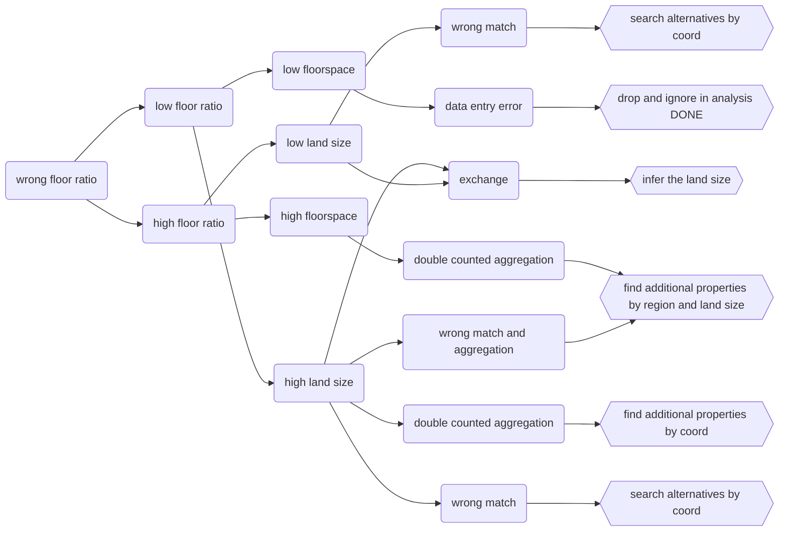

## 4 adjust for housing unit


## 3 balanced adjustment

- adjust floor space
  - group by col34, col48, col49, col161. 
    - any col202 that is five times larger than p50 of col202 is marked as outliners.
      - compare sum col202 with 2* sum outliners, choose whichever larger.
- adjust land size
  - include observations from other building type, but not those removed in adjust floor space
  - allocate lands acoording to the floorspace shares
  - use SF condo as a case study
    - check if I should merge nearby regions
  - procedure
    - group by "col34", "col48", "col49", "col161"
    - check total count and missing count

## 2a

- check overlapping entires
    - keep if col202 not missing
    - group by col48, col49, col161, then compute the group count
    - keep observation with group count more than 5
     - compute the max col202, the second largest col202, the third largest col202, the fourth largest col202, the fifth largest col202, the median col202, the min col202. 
    - compute ratio = max col202/min col202

## 2

- conduct extreme measures
  - high floor ratio
    - higher land size
      - group by coord, select the largest land
      - group by region and floorspace, select the largest land
      - select the largest of the two
    - low floor space
      - group by coord, or group by region and floorspace, discount by count

```
property_current <- readRDS(property_current_rds)
property_current_dt <- as.data.table(property_current)

Group the data by col161 and col3, calculate the count of each group as count1, and find the highest value of col161 in each group as hcol161.
Ungroup the data.
Group the data by col48 and col49, calculate the count of each group as count2, find the highest value of col161 in each group as hhcol161
.
Calculate the value of eh_land as pmax(hcol161,hhcol161)
Calculate the value of el_floorspace = col202/pmax(count1, count2)
Calculate the value of el_floor_ratio = el_floorspace/eh_land
```


## 1a

- for SF condo
  - the impact of changing floorspace is good sometime, but not all the time
  - changing land size is consistently more effective
  - comment
    - changing floorspace is useful when there is a super floorspace outliner, possibly due to wrong aggregation
    - in contrast, changing land size always work

## 1 

- conduct extreme measures
  - low floor ratio
    - lower land size
      - discount land by the number of property with the same size or by the number of property at the same coord
      - select the lowest land size by coord
    - higher floorspace
      - select the highest floorspace by coord
      - select the highest floorspace by land size

```
Group the data by col161, calculate the count of each group as count1, and find the highest value of col202 in each group as hcol202.
Ungroup the data.
Group the data by col48 and col49, calculate the count of each group as count2, find the lowest value of col161 in each group as lcol161, and find the highest value of col202 in each group as hhcol202.
Calculate the value of el_land as lcol161 divided by the sum of count1 and count2.
Calculate the value of eh_floorspace as the maximum of hcol202 and hhcol202.
Calculate the value of eh_floor_ratio as eh_floorspace divided by el_land.
```

```
property_current %<>%
  group_by(col_161) %>%
  mutate(count1 = n(), hcol_202 = max(col_202, na.rm = TRUE)) %>%
  ungroup() %>%
  group_by(col_48, col_49) %>%
  mutate(count2 = n(), lcol_161 = min(col_161, na.rm = TRUE), hhcol_202 = max(col_202, na.rm = TRUE)) %>%
  mutate(el_land = lcol_161/max(count1, count2, na.rm = TRUE),
         eh_floorspace = max(hcol_202, hhcol_202, na.rm = TRUE),
         eh_floor_ratio = eh_floorspace/el_land)

exam1 <- property_current %>%
    filter(col_34 == 112, col_3 == 6013)
```

comment on the result:

- 112 and 161 at 6015 lower end come to a normal range
- but for 6013, 6077, lower end still does not make sense

